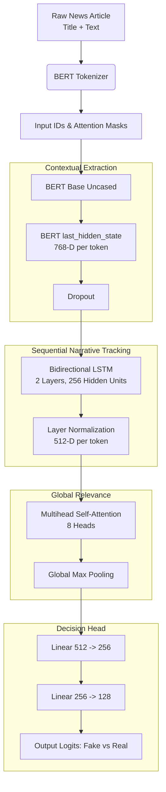

# TruthLens: BERT-Based Fake News and Misinformation Detector

## Overview
This project is an advanced, deep-learning-based Fake News Detection system fine-tuned on the **WELFake** dataset. It leverages state-of-the-art Natural Language Processing (NLP) tailored specifically to identify nuanced narrative markers of misinformation. The architecture features an enhanced Transformer-Recurrent pipeline that integrates **BERT**, a **Bidirectional LSTM**, and **Multihead Attention**.

## Model Architecture
The TruthLens core model (`EnhancedBertForSequenceClassification`) combines robust contextual embeddings with sequence-tracking recurrent layers.



### Detailed Component Breakdown: How It Works

1. **BERT Encoder (`bert-base-uncased`)**: 
   - Instead of immediately aggregating text using the static sequence `[CLS]` token (standard practice), this approach extracts the dense semantic representations of *every single token* across the 512-word sequence. 
   - **Why?** Each token has 768 features rich with contextual meaning (e.g. knowing if "bank" means a river bank vs. a financial institution).

2. **Bidirectional LSTM (`Bi-LSTM`)**: 
   - Misinformation is heavily structured by **narrative flow**—for example, starting with a factual premise, inserting an emotionally charged subjective claim, and ending with a clickbait conclusion. 
   - While BERT captures context simultaneously, the Bi-LSTM sequentially traces the article left-to-right *and* right-to-left. 
   - **Why?** It maps exactly how the argument logically unfolds over time. It compresses the 768 BERT features into 512 sequence-aware continuous dimensions.

3. **Multihead Self-Attention**:
   - The LSTM output is passed into an 8-head self-attention module. 
   - **Why?** This lets the network cross-reference all the sequence steps and aggressively weigh specific "suspicious" turning points or phrase combinations across the article, ensuring it doesn't get distracted by generic filler sequences.

4. **Global Max Pooling**:
   - Rather than averaging all the sequence data or taking the last step, it looks across the entire sequence and plucks the absolute highest, strongest semantic activation signals that imply deception.

5. **Feed-Forward Classifier**:
   - A multi-layer perceptron (with ReLU activations and Dropout mapping `512 -> 256 -> 128 -> 2`) gradually shapes the mathematical representation down to two probabilities representing the final prediction (Real vs Fake).

## Dataset: WELFake
- **Total Samples:** ~72,134 news rows (Fake: 37,106 | Real: 35,028)
- **Features Used:** To give the model the best opportunity to spot deception, the isolated **Title** and **Body Text** are concatenated (joined by `[SEP]`) to provide maximum context. 
- **Handling Imbalance:** The model loader implements `WeightedRandomSampler` and automated class-weight calculations for the Loss function to prevent bias.

## Baseline Comparisons
The notebook evaluates standard baseline classifiers on the same dataset using `TF-IDF` vectorization to act as a benchmark proving the superiority of the deep learning architecture. 
Included models:
- Logistic Regression
- Random Forest Classifier
- Linear Support Vector Classifier (SVC)

## Requirements
```bash
pip install torch transformers pandas numpy scikit-learn seaborn matplotlib tqdm
```

## Usage
Run the Jupyter Notebook `updated_wel-fakebert-finetune-notebook.ipynb` sequentially. To edit training hyper-parameters, simply locate the `CONFIG` dictionary at the top of the training phase. The model automatically implements Early Stopping based on the Validation F1 Score to prevent over-training on large epoch scales.
